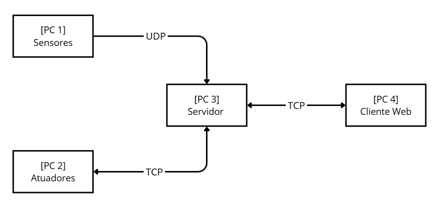

# 🍷 Vinicola — Simulação de Sistema de Monitoramento 

Sistema distribuído de monitoramento e automação para uma vinícola, desenvolvido em **Go (Golang)**. O sistema simula sensores físicos, processa dados em um broker central, controla atuadores remotamente e exibe tudo em um painel web em tempo real.

---

## Sumário

- [Visão Geral da Arquitetura](#visão-geral-da-arquitetura)
- [Estrutura de Diretórios](#estrutura-de-diretórios)
- [Componentes](#componentes)
- [Requisitos](#requisitos)
- [Configuração de IPs](#configuração-de-ips)
- [Como Executar o Programa](#como-executar-o-programa)
- [Como Usar o Painel Web](#como-usar-o-painel-web)
- [Comunicação entre Serviços](#comunicação-entre-serviços)
- [Automação do Sistema](#automação-do-sistema)
- [Variáveis de Ambiente](#variáveis-de-ambiente)
- [Resolução de Problemas](#resolução-de-problemas)

---

## Visão Geral da Arquitetura

O sistema foi projetado para funcionar distribuído em **múltiplos computadores (PCs)** em uma rede local conforme diagrama abaixo:



- **Sensores** enviam dados via **UDP** para o Broker a cada 1ms.
- **Broker** agrega, processa, aplica física simulada, executa automação e persiste o estado.
- **Atuadores** aguardam comandos TCP e respondem com confirmação.
- **Cliente Web** exibe gráficos ao vivo e permite controle manual dos atuadores via interface HTTP.

---

## Estrutura de Diretórios

```
vinicola/
├── broker/
│   ├── main.go                 # Servidor: recebe sensores, gerencia automação, serve o cliente, faz comunicação com os atuadores
│   ├── Dockerfile              # Imagem Docker do broker (Go 1.21 Alpine)
│   └── docker-compose.yml      # Sobe o serviço broker
│
├── sensores/
│   ├── main.go                 # Simulador dos 5 sensores
│   ├── Dockerfile              # Imagem Docker dos sensores (Go 1.21 Alpine)
│   ├── docker-compose.yml      # Define os 5 sensores como serviços
│   └── iniciar_sensores.sh     # Script: inicia os 5 sensores em containers
│
├── atuadores/
│   ├── main.go                 # Servidor TCP que recebe e confirma comandos
│   ├── Dockerfile              # Imagem Docker dos atuadores (Go 1.21 Alpine)
│   ├── docker-compose.yml      # Define os 3 atuadores como serviços
│   └── iniciar_atuadores.sh    # Script: inicia os 3 atuadores em containers
│
└── cliente/
    ├── main.go                 # Servidor HTTP (web) + proxy TCP para o broker
    ├── Dockerfile              # Imagem Docker do cliente (Go 1.21 Alpine)
    └── docker-compose.yml      # Sobe o serviço cliente na porta 3000

```

---

## Componentes

### 🧠 Broker (`broker/`)
Coração do sistema. Responsável por:
- Receber dados dos sensores via **UDP na porta 8080**
- Faz comunicação com o atuadores via **TCP**
- Agregar leituras (média a cada 2 segundos)
- Aplicar **física simulada** (efeito dos refrigeradores na temperatura, fermentação na densidade, bomba no nível conforme os comandos dos atuadores)
- Executar **lógica de automação** (ligar/desligar atuadores automaticamente)
- Monitorar **saúde dos sensores e atuadores** com fail-safe para garantir a conexão
- Atender o **cliente web via TCP na porta 8081**
- **Persistir o estado** em `estado_broker.json` a cada 5 segundos

### 📡 Sensores (`sensores/`)
5 sensores simulados, cada um rodando em container independente:

| Sensor | Tipo | Faixa | Envio |
|---|---|---|---|
| `sensor-temp-mosto` | Temperatura do Mosto | 12°C – 35°C | 1ms |
| `sensor-densidade` | Densidade do Mosto | 0.990 – 1.095 | 1ms |
| `sensor-umidade-adega` | Umidade da Adega | 40% – 95% | 1ms |
| `sensor-temp-adega` | Temp da Adega | 8°C – 22°C | 1ms |
| `sensor-nivel-dorna` | Nível da Dorna | 0% – 100% | 1ms |

Cada sensor usa um **simulador senoidal com ruído** para gerar dados mais próximos da realidade, apresentando variações suaves e evitando mudanças bruscas irrealistas.

### ⚙️ Atuadores (`atuadores/`)
3 atuadores que escutam comandos TCP:

| Atuador | Container | Porta TCP |
|---|---|---|
| Resfriamento do Mosto | `atuador-resfriamento-mosto` | 9090 |
| Bomba de Trasfega | `atuador-bomba-trasfega` | 9091 |
| Resfriamento da Adega | `atuador-resfriamento-adega` | 9092 |

Ao receber um comando, o atuador imprime no terminal e responde `CONFIRMADO: <comando>`.

### 💻 Cliente Web (`cliente/`)
Servidor HTTP em Go (sem frameworks externos) que:
- Serve o painel HTML/CSS/JS na porta **3000**
- Age como **proxy TCP** entre o browser e o broker
- Expõe a API REST interna:
  - `GET /api/status` — retorna estado completo (sensores, alertas, ações, status de atuadores)
  - `POST /api/comando?porta=PORT&acao=CMD` — envia comando ao broker

O HTML é **embarcado diretamente no binário Go** (sem arquivos estáticos externos).

---

## Requisitos

- **Docker** (versão 20+) e **Docker Compose** (versão 1.29+ ou v2)
- **tmux** (opcional, mas recomendado para facilitar rodar todos os programas)
- Rede local entre os PCs (para implantação distribuída)
- Portas abertas no firewall: `8080/udp`, `8081/tcp`, `3000/tcp`, `9090-9092/tcp`

---

## Configuração de IPs

Antes de executar, edite os IPs nos arquivos conforme a topologia da sua rede:

| Arquivo | Variável | Descrição |
|---|---|---|
| `broker/docker-compose.yml` | `ATUADOR_HOST` | IP do PC onde os atuadores estão rodando |
| `sensores/iniciar_sensores.sh` | `SERVER_IP` | IP: Porta do PC onde o broker está (ex: `192.168.1.10:8080`) |
| `sensores/docker-compose.yml` | `SERVER_IP` (default) | Valor padrão se a variável não for passada |
| `atuadores/iniciar_atuadores.sh` | `SERVER_IP` | IP do broker (para registro; os atuadores só escutam) |
| `cliente/docker-compose.yml` | `BROKER_HOST` | IP do PC onde o broker está rodando |

**Exemplo com todos na mesma máquina (desenvolvimento local):** use `172.17.0.1` (gateway Docker padrão) ou o IP da máquina host na rede Docker.

---

## Como Executar o Programa

### Opção A — Implantação Distribuída (recomendada)

Execute cada componente no PC correto:


**PC 1 — com Sensores:**
```bash
cd sensores/
chmod +x iniciar_sensores.sh
./iniciar_sensores.sh
```
> O script detecta automaticamente `tmux`, `xterm` ou faz fallback para logs em arquivo.

**PC 2 — com Atuadores:**
```bash
cd atuadores/
# Instalar tmux (Opcional):
sudo apt install tmux
chmod +x iniciar_atuadores.sh
./iniciar_atuadores.sh
```

**PC 3 — Broker:**
```bash
cd broker/
docker-compose build --no-cache broker
docker-compose up broker
```

**PC 4 — Cliente Web:**
```bash
cd cliente/
docker-compose build --no-cache cliente
docker-compose up cliente
# Acesse: http://localhost:3000
```

---

### Opção B — Tudo em uma única máquina (testes locais)

Suba os componentes em terminais separados na ordem abaixo:

```bash
# Terminal 1: Broker
cd broker && docker-compose up --build

# Terminal 2: Atuadores
cd atuadores && ./iniciar_atuadores.sh

# Terminal 3: Sensores
cd sensores && ./iniciar_sensores.sh

# Terminal 4: Cliente Web
cd cliente && docker-compose up --build
# Acesse: http://localhost:3000
```

---

### Parar os serviços

Dentro de cada pasta, execute:
```bash
docker-compose down
```

---

## Como Usar o Painel Web

Acesse **http://localhost:3000** (no PC onde o cliente está rodando).

O painel exibe:

- **Gráficos ao vivo** de cada sensor com os últimos 10 minutos de histórico
- **Status online/offline** dos sensores (banner vermelho quando um cai)
- **Painel de Atuadores** com botões Ligar/Desligar (desabilitados se o atuador estiver offline)
- **Badges de status** no header indicando se cada atuador está ligado ou desligado
- **Histórico de Ações** — últimas 5 ações com hora, origem (AUTO/MANUAL) e status (CONFIRMADO/FALHA)
- **Alertas do Sistema** — últimos 10 alertas críticos e avisos

> O painel atualiza automaticamente a cada **1 segundo**. Se o broker cair os dados são congelados na tela.

**Comandos disponíveis via interface:**

| Atuador | Ação | Comando enviado |
|---|---|---|
| Resfriamento do Mosto | Ligar / Desligar | `LIGAR_REFRIG_MOSTO` / `DESLIGAR_REFRIG_MOSTO` |
| Resfriamento da Adega | Ligar / Desligar | `LIGAR_REFRIG_ADEGA` / `DESLIGAR_REFRIG_ADEGA` |
| Bomba de Trasfega | Acionar / Parar | `ACIONAR_BOMBA` / `PARAR_BOMBA` |

---

## Comunicação entre Serviços

```
Sensores  ──UDP──►  Broker:8080
                    Broker:8081  ◄──TCP──►  Cliente
                    Broker       ◄──TCP──►  Atuadores:9090/9091/9092
```

| Protocolo | Direção | Porta | Dados |
|---|---|---|---|
| UDP | Sensores → Broker | 8080 | JSON: `{"id","tipo","valor"}` |
| TCP | Broker → Atuadores | 9090–9092 | Texto: `LIGAR_REFRIG_MOSTO\n` |
| TCP | Cliente → Broker | 8081 | Texto: `GET_STATUS\n` ou `CMD:9090:LIGAR_REFRIG_MOSTO\n` |
| TCP | Browser → Cliente | 3000 | REST: `GET /api/status`, `POST /api/comando` |

---

## Automação do Sistema

O broker executa as seguintes regras automaticamente a cada 2 segundos:

**Refrigeração do Mosto:**
- Liga quando temperatura > 24.5°C
- Desliga quando temperatura < 17.5°C

**Refrigeração da Adega:**
- Liga quando temperatura > 16.5°C
- Desliga quando temperatura < 11.5°C

**Bomba de Trasfega:**
- Aciona automaticamente quando densidade ≤ 1.010 (fermentação concluída)
- Para quando nível da dorna ≤ 5% (dorna vazia)
- Entra em cooldown de 30 segundos após parar
- Aguarda nova leva antes de reativar

**Sistema Fail-Safe:**
Se um sensor cair enquanto o atuador correspondente estiver ligado, o broker desliga o atuador imediatamente por segurança e gera um alerta crítico.

---

## Variáveis de Ambiente

### Broker
| Variável | Padrão | Descrição |
|---|---|---|
| `ATUADOR_HOST` | `172.16.103.13` | IP do host onde os atuadores estão rodando |

### Sensores
| Variável | Padrão | Descrição |
|---|---|---|
| `SERVER_IP` | `172.16.103.1:8080` | Endereço `IP:Porta` do broker |
| `SENSOR_ID` | `SENS-01` | Identificador único do sensor |
| `SENSOR_TIPO` | `Temperatura do Mosto` | Tipo de dado simulado |

### Atuadores
| Variável | Padrão | Descrição |
|---|---|---|
| `SERVER_IP` | `172.16.103.1:8080` | IP do broker (usado pelo script de inicialização) |
| `ATUADOR_NOME` | `Atuador Generico` | Nome descritivo exibido nos logs |
| `ATUADOR_PORTA` | `9090` | Porta TCP em que o atuador escuta |

### Cliente
| Variável | Padrão | Descrição |
|---|---|---|
| `BROKER_HOST` | `172.16.103.1` | IP do broker (sem porta, o cliente usa :8081 fixo) |

---

## Dependências e Pacotes

Todo o sistema usa **apenas a biblioteca padrão do Go** — sem dependências externas nos serviços principais. O painel web usa o seguinte CDN externo (carregado pelo browser, não pelo servidor):

- **Chart.js** via CDN `cdn.jsdelivr.net` — renderização dos gráficos de linha

### Pacotes Go utilizados por módulo

**Broker / Atuadores / Sensores / Cliente (stdlib apenas):**
```
bufio       encoding/json    fmt     math
math/rand   net              os      strings
sync        time
```

---

## Resolução de Problemas

**Sensores não aparecem no painel:**
- Verifique se `SERVER_IP` no `iniciar_sensores.sh` aponta para o IP correto do broker
- Confirme que a porta UDP 8080 está aberta no firewall do broker

**Atuadores aparecem como OFFLINE:**
- Verifique se `ATUADOR_HOST` no `docker-compose.yml` do broker aponta para o IP correto
- Confirme que as portas 9090–9092 estão abertas e os containers dos atuadores estão rodando

**Painel mostra "CONEXÃO COM O BROKER PERDIDA":**
- Verifique se `BROKER_HOST` no `docker-compose.yml` do cliente está correto
- Confirme que o broker está rodando e a porta 8081 está acessível

**Broker não inicializa:**
```bash
cd broker
docker-compose down
docker-compose build --no-cache broker
docker-compose up broker
```

**Verificar logs de um container específico:**
```bash
docker logs vinicola-broker
docker logs vinicola-cliente
docker logs atuador-resfriamento-mosto
```
